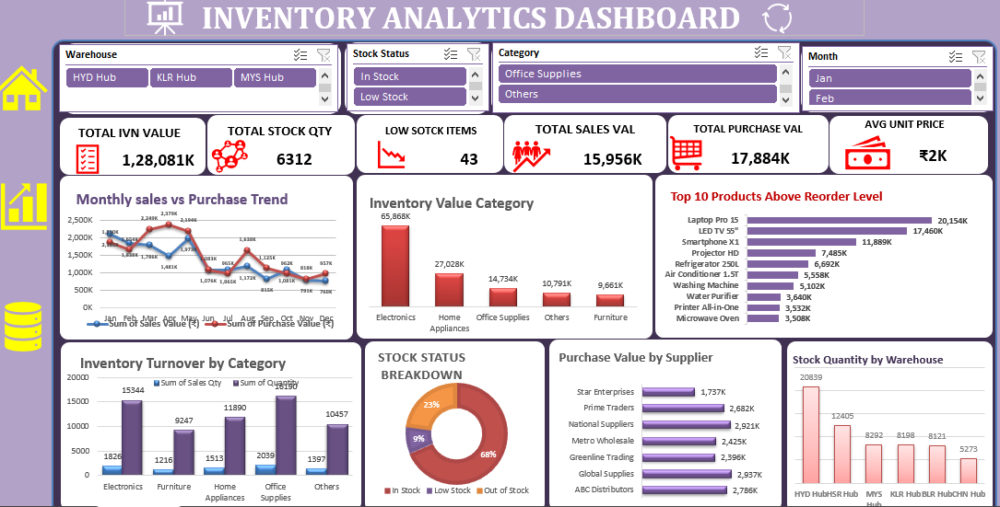

# 📊 Inventory Analytics Dashboard

An interactive Inventory Analytics Dashboard developed in Microsoft Excel to analyze inventory performance, stock availability, sales, purchases, suppliers, warehouses, and reorder-level products.

## 📌 Project Overview

This project transforms inventory data into an interactive and visually informative dashboard that helps monitor key inventory metrics and identify stock-related insights.

The dashboard provides a consolidated view of inventory performance through KPIs, charts, filters, and category-level analysis.

## 🎯 Objectives

- Monitor overall inventory value and stock quantity
- Identify low-stock items
- Analyze monthly sales and purchase trends
- Compare inventory value across product categories
- Identify products above reorder levels
- Analyze inventory turnover by category
- Monitor stock status distribution
- Analyze purchase value by supplier
- Compare stock quantity across warehouses

## 📊 Dashboard KPIs

The dashboard includes key performance indicators such as:

- Total Inventory Value
- Total Stock Quantity
- Low Stock Items
- Total Sales Value
- Total Purchase Value
- Average Unit Price

## 📈 Key Visualizations

- Monthly Sales vs Purchase Trend
- Inventory Value by Category
- Top 10 Products Above Reorder Level
- Inventory Turnover by Category
- Stock Status Breakdown
- Purchase Value by Supplier
- Stock Quantity by Warehouse

## 🛠️ Tools & Technologies

- Microsoft Excel
- Pivot Tables
- Pivot Charts
- Data Analysis
- Data Visualization
- Interactive Filters / Slicers
- KPI Analysis

## 🔍 Dashboard Features

The dashboard includes interactive filters for:

- Warehouse
- Stock Status
- Category
- Month

These filters allow users to explore inventory performance from different business perspectives.

## 💡 Business Insights

The dashboard can help inventory and operations teams:

- Identify products requiring inventory attention
- Monitor stock availability
- Track purchasing and sales trends
- Compare warehouse-level inventory
- Analyze supplier purchase values
- Monitor inventory turnover
- Support data-driven inventory planning

## 🖼️ Dashboard Preview

## 📂 Project Files

| File | Description |
|------|-------------|
| `Inventory_Analytics_Dashboard.xlsx` | Excel dashboard |
| `Inventory_Analytics_Dashboard.png` | Dashboard preview |

## 👩‍💻 Author

**Diksha Vishwakarma**

Data Analyst / Data Science Portfolio
